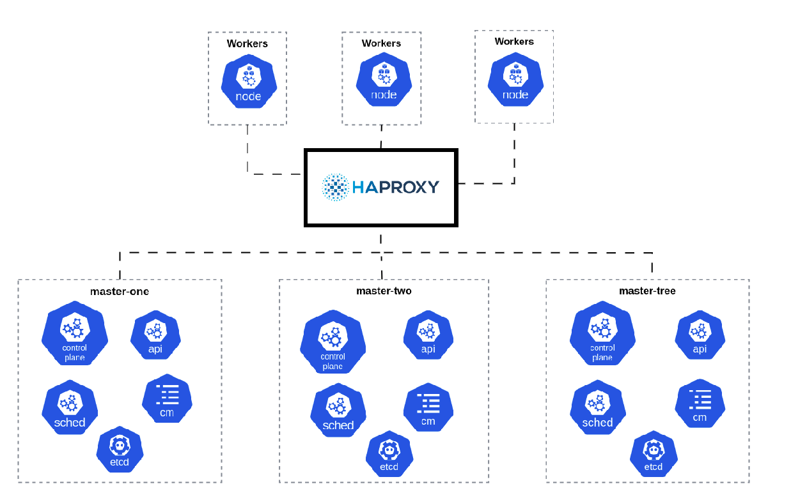

# kubernetes-ansible

## Dependencies

- ansible == 2.16.5

## SO tested and support

- Ubuntu 20
- Ubuntu 22

#
# ATTENTION

**This laboratory is intended for learning or testing purposes and cannot be used in production environments**
#

## Variables

| Name | Description | Default | Mandatory 
|------|-----------|---------|------------|
| multi_controlplane | Enabled multi-controlplane  | false | no
| join_masters | Join others VM controlplane used when multi-controlplane for true | false | no
| ip_external | Ip external used when multi-controlplane for true | false | no
| single_controlplane | Enabled single-controlplane  | false | yes
| workers | Enabled workers  | false | yes
| version_k8s | version k8s | v1.26 | no
| network_plugin | network plugin addon (weave/cilium/flannel/calico)  | weave | no
| ingress_class | controler-ingress-class (nginx)  | nginx | no
| controller_openebs | controler-volumes (openebs)  | true | no
| container_runtime | container runtime (docker/containerd) | containerd | no
| ha_proxy | Enabled haproxy | false | no
| haproxy_config | config haproxy | [] | no
| virtual_ipaddress | Network virtual | "" | no
| ver_haproxy | Version HAproxy | 2.8 | no

***You can use vagrant***



### For instalation:

 [vagrant](https://www.vagrantup.com/downloads)

 [virtualbox](https://www.virtualbox.org/wiki/Downloads)

- Provision the VM

```bash
vagrant up 
```

[OPTIONAL] - *configured for the host-only network is not within the allowed ranges*

```bash
The IP address configured for the host-only network is not within the
allowed ranges. Please update the address used to be within the allowed
ranges and run the command again.

  Address: 172.16.33.12
  Ranges: 192.168.56.0/21

Valid ranges can be modified in the /etc/vbox/networks.conf file. For
more information including valid format see:

  https://www.virtualbox.org/manual/ch06.html#network_hostonly
```
```bash
sudo mkdir /etc/vbox
```
```bash
sudo echo "* 0.0.0.0/0 ::/0" | sudo tee /etc/vbox/networks.conf
```
#
- Access via ssh

```bash
vagrant ssh
```
- Shutdown the VM

```bash
vagrant halt
``` 

kubeconfig is saved in the current directory

```bash
export KUBECONFIG=./kubeconfig.yaml
```

## Example playbook single controlplane

```yaml
---
- name: Kubernetes Installation master
  hosts: master
  vars:
    network_plugin: "flannel"
    controller_openebs: true
    ingress_class: "nginx"
    single_controlplane: true
    container_runtime: "docker"
    version_k8s: v1.27
  become: yes
  roles:
  - kubernetes  

- name: Kubernetes Installation workers
  hosts: workers
  vars:
    workers: true
    container_runtime: "docker"
    version_k8s: v1.27
  become: yes
  roles:
  - kubernetes  
```

## Example playbook multi controlplane and HAproxy

```yaml
---
- name: HAProxy Installation
  hosts: ha
  vars:
    ha_proxy: true
    virtual_ipaddress: 172.16.33.15
    haproxy_config:
      - name: master-one 
        ip: 172.16.33.10
      - name: master-two 
        ip: 172.16.33.11
      - name: master-tree
        ip: 172.16.33.12
  become: yes
  roles:
  - kubernetes  

- name: Kubernetes Installation master-one
  hosts: master-one
  vars:
    network_plugin: "weave"
    controller_openebs: true
    ingress_class: "nginx"
    multi_controlplane: true
    container_runtime: "containerd"
    ip_external: 172.16.33.15
    version_k8s: v1.27
  become: yes
  roles:
  - kubernetes  

- name: Kubernetes Installation masters
  hosts: masters
  vars:
    join_masters: true
    container_runtime: "containerd"
    version_k8s: v1.27
  become: yes
  roles:
  - kubernetes 

- name: Kubernetes Installation workers
  hosts: workers
  vars:
    workers: true
    container_runtime: "containerd"
    version_k8s: v1.27
  become: yes
  roles:
  - kubernetes 
```

**In the groups_vars directory you can set the variables for each host**

 - all will be applied to all, and the others separated by their respective groups

```shell
group_vars/
├── all
├── ha
├── master-one
├── masters
└── workers
```

## Example file inventory

```bash
[master-one]
172.16.33.10 ansible_ssh_private_key_file=.vagrant/machines/master-one/virtualbox/private_key 
[masters]
172.16.33.11 ansible_ssh_private_key_file=.vagrant/machines/master-two/virtualbox/private_key 
172.16.33.12 ansible_ssh_private_key_file=.vagrant/machines/master-tree/virtualbox/private_key 
[workers]
172.16.33.13 ansible_ssh_private_key_file=.vagrant/machines/worker-one/virtualbox/private_key 
[ha]
172.16.33.14 ansible_ssh_private_key_file=.vagrant/machines/haproxy/virtualbox/private_key

[all:vars]
ansible_user=vagrant
ansible_ssh_common_args='-o StrictHostKeyChecking=no'
#ansible_password="Mypassword"

```

### For execute

```bash
ansible-playbook -i inventory playbook.yml
```

**kubeconfig is saved in the current directory**

```bash
export KUBECONFIG=./kubeconfig.yaml
```

## Use HAProxy

**vars**

```bash
    ha_proxy: true
    virtual_ipaddress: 172.16.33.15
    haproxy_config:
      - name: master-one 
        ip: 172.16.33.10
      - name: master-two 
        ip: 172.16.33.11
      - name: master-tree
        ip: 172.16.33.12
```
Access URL

http://172.16.33.14:8080/stats


## License

GPLv3
